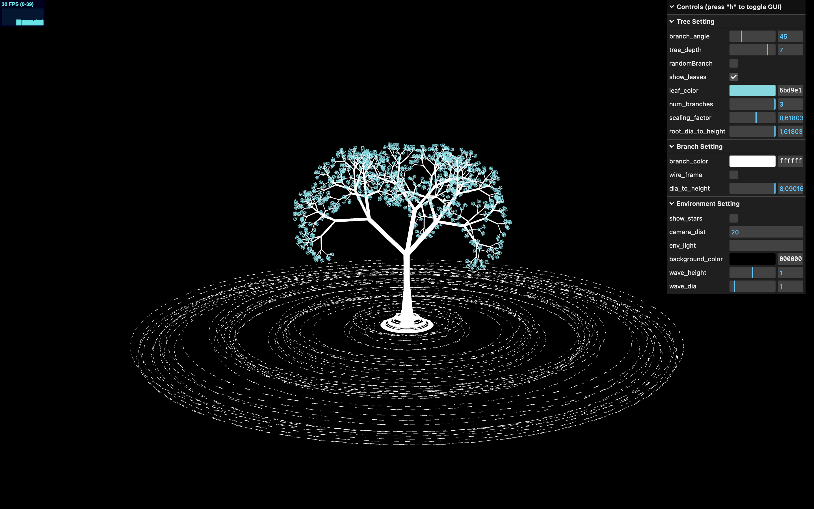

# Fractal Tree of Life

> Interactive 3D fractal tree built with Three.js



## Live Demo

[srjoy5000.github.io/tree-of-life](https://srjoy5000.github.io/tree-of-life/)

---

## Features

- **Recursive fractal tree** — configurable depth (2–8), branch count, angle, and scaling factor
- **Animated wave rings** — 50 torus rings oscillate vertically using per-ring randomized sine offsets
- **Real-time GUI controls** — adjust all tree and environment parameters without reloading
- **Orbit controls** — drag to orbit, scroll to zoom, right-click to pan

## Controls

| Key / Input | Action                         |
| ----------- | ------------------------------ |
| `h`         | Toggle GUI and FPS stats panel |
| `r`         | Toggle auto-rotation           |
| Drag        | Orbit camera                   |
| Scroll      | Zoom                           |

## Tech Stack

|                |                                                                      |
| -------------- | -------------------------------------------------------------------- |
| **Renderer**   | [Three.js](https://threejs.org/) v0.179                              |
| **Build tool** | [Vite](https://vitejs.dev/)                                          |
| **GUI**        | [lil-gui](https://lil-gui.georgealways.com/) (bundled with Three.js) |
| **Deploy**     | GitHub Pages via `gh-pages`                                          |

## Project Structure

```
tree-of-life/
├── src/
│   ├── main.js        # Entire scene: config, tree, wave, GUI, render loop
│   ├── style.css
│   └── images/
├── public/
├── index.html
├── vite.config.js
└── package.json
```

## Quick Start

```bash
# Install dependencies
npm install

# Start dev server with hot reload
npm run dev

# Build for production
npm run build

# Deploy to GitHub Pages
npm run deploy
```

## GUI Parameters

**Tree Settings**

- `branch_angle` — angle between parent and child branches (0–180°)
- `tree_depth` — recursion depth (2–8); higher values are more expensive
- `num_branches` — 2 or 3 branches per node
- `scaling_factor` — size ratio between depth levels (default: 1/φ ≈ 0.618)
- `show_leaves` / `leaf_color` — toggle and color cube leaves at the deepest level

**Branch Settings**

- `branch_color` — branch material color (mutates shared material, no rebuild)
- `wire_frame` — toggle wireframe mode

**Environment Settings**

- `background_color` — scene background color
- `wave_height` / `wave_dia` — scale the animated wave rings

---

**Developed by [srjoy5000](https://github.com/srjoy5000)**
